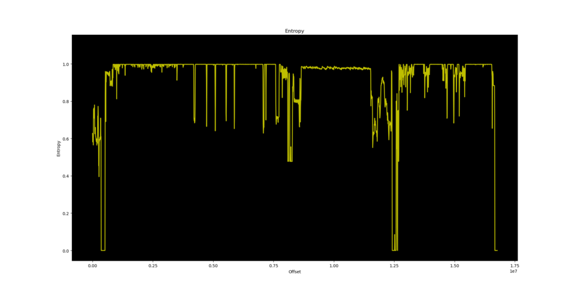

# Powkiddy X3/J6

|     |                 |
|-----|-----------------|
| Cpu | Actions ATS3603 |
| Memory | 64 MB DDR SDRAM Hynix HY5DU121622CTP |
| Display | 4.3 "IPS screen (800x480) |
| Battery | 1200 mah (3.7V) internal non-removable battery |
| Audio | 3.5 headphone jack (Stereo) input, built-in mono speaker. Microphone |
| USB | MiniUSB |
| Storage | micro SD |
| Controls | Stick left analog, D-Pad, buttons A, B, X, Y, L, R, Start, Select, Vol (+), Vol (-), ON / OFF |
| OS | Free Open Source microC / OS (as the Powkiddy X16 / X19 consoles) |
| Emulators | CPS1, CPS2, MVS, MD (without SVP support), SNES (without special chips), NES, GB / GBC and GBA. Master System, Game Gear and PC Engine a through the GBA scene |

## Reversing

In ``ghidra`` load the flash dump at ``0xb4040000``

since from [rockbox's wiki](https://www.rockbox.org/wiki/ATJ213xFirmware#Booting_sequence) about the boot sequence:

    On power on the CPU begin execution at VA=0xbfc00000 (PA=0x1fc00000) where BROM
    is mapped. BROM loads MBRCF*.BIN stored at the beginning of nand flash into iram
    (VA=0xb4040000, PA=0x14040000), check signature and checksum and passes control
    to the just loaded code. MBRCF* initializes caches, clocks, DRAM, loads BREC*
    loader to the DRAM (VA=0x80000000, PA=0x00000000) and passes control to the
    BREC. BREC checks logical structure of flash, loads and passes control to uCOS
    kernel. If at any stage of load chain en error is encountered 'Hard DFU' handler
    stored at 0xbfc05400 (0x1ffc bytes) in BROM is copied to 0xb4046800 and CPU
    jumps to this handler.


at that point you can find the ``ActBrm`` signature at address ``0xb4041f4``
as expected from ATJ213x firmwares.

Now we see that after a block that resembles a partition where the first 12 bytes
are the name; the structure is the following

```c
struct partition_t {
	char label[12];
	uint32_t type;
	uint32_t _unknown;
	uint32_t block_offset; /* block size of 512 bytes */
	uint32_t size; /* in bytes */
	uint32_t checksum; /* to be confirmed */
};
```

From each section of the partition is possible to extract raw binaries that have
a common "header" (the first four dwords) with information about their loading:

 - upper limit of the memory used
 - max extension of memory needed
 - base address
 - entry point

| Label | Description | load address |
|-------|-------------|--------------|
| ``brecf03.bin`` | boot record ??? | ``0xc3080000`` |
| ``storage.bin`` | | ``0xc30a0000`` |
| ``mfp.bin`` | configure gpios ??? | ``0xc0280000`` |
| ``fb.bin`` | configure framebuffer ??? | ``0xc0200000`` |
| ``upg.bin`` | upgrade code | ``0xc0400000`` |

The most important is the ``brec`` one, it sets a jump table at address
``0xc3080e00`` that is called from the other binaries to perform common service;
take note that the tenth entry is the ``log`` function!

This extracted binaries are only a little portion of the total content of the
flash, at ``0xb40c0000`` (offset ``0x80000``, 512KB) starts something else.



